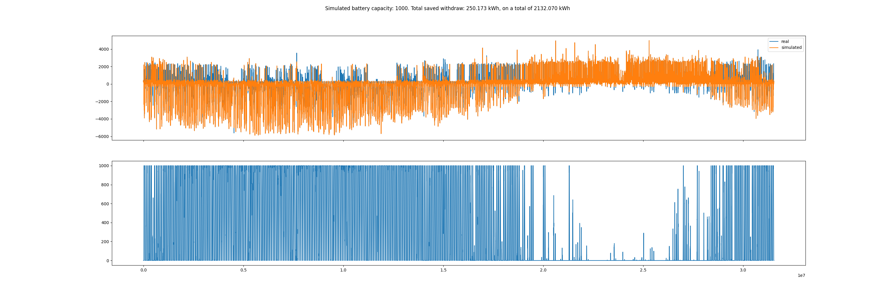
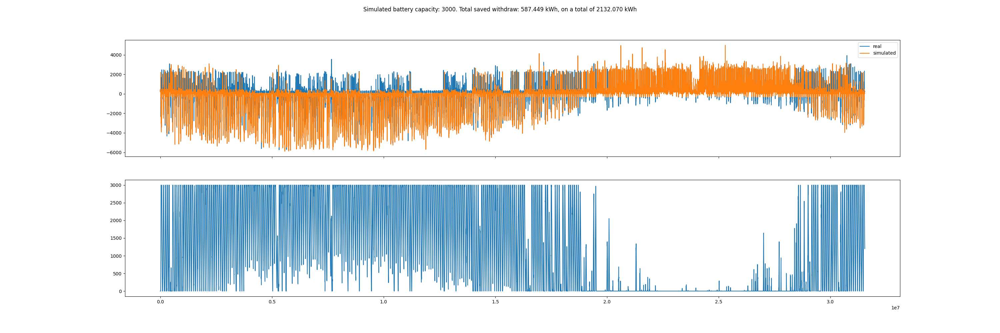
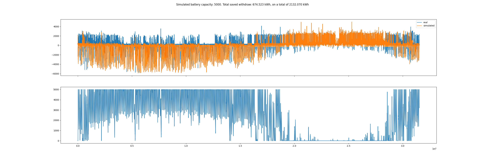
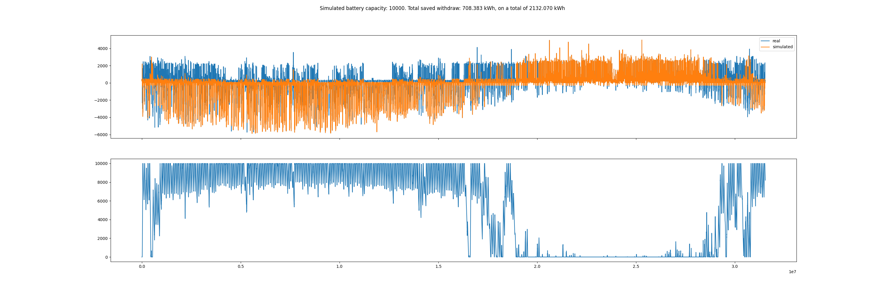
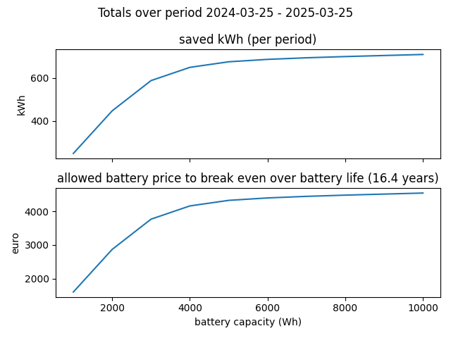

# Simulatie thuisbatterij

Om idee te krijgen van het al dan niet interessant worden van de thuisbatterij (nu nog niet van toepassing, hooguit na het afschaffen van saldering vanaf 2027), in een wereld waarin mooi-weer-verhalen vooral het onderbuikgevoel aanspreken, heb ik mijn verbruiksgegevens erbij gepakt en gesimuleerd wat een thuisbatterij van gegeven grootte zou doen, wat dat zou schelen in afname van het net (per jaar), wat dat financieel gezien zou schelen en hoe dat in verhouding staat tot de levensduur van zo'n apparaat.

[simulate_home_battery.py](simulate_home_battery.py)
Je kunt de simulatie op eigen data toepassen door in `get_instant_p1_values` een DataFrame te vullen met gegevens van de P1 meter (afgenomen en ingevoed vermogen).

## Aannames:
- Doel van de thuisaccu: overschot van zonnepanelen uitsmeren over de dag/nacht om minder stroom aan het net te hoeven onttrekken. 
  - Het verhandelen van opgewekte stroom (verkopen op een duur moment of zelfs opladen uit het net op goedkope momenten) neem ik niet mee in de simulatie.
- Efficiëntie om energie op te slaan in de accu: 80%
- Efficiëntie om energie uit de accu te halen: 80%
- Minimaal overschot uit panelen (dat niet instantaan gebruikt wordt in huis) om accu op te laden: 300 Watt 
  - Dit om geen valse aanname te doen over momenten dat je verbruik ongeveer gelijk is aan de opbrengst van je panelen en je dus netto rond 0 zit op de P1 meter
  - behoudens deze grens ga ik uit van per-minuut schakelen tussen laden, niets doen of ontladen op basis van de P1 meter.
- Maximaal vermogen dat accu terug kan afgeven: 2500 Watt
- Aantal op/ontlaad-cycli voordat accu af is: 6000    
  - merk op: dat is 16 jaar dagelijks op/ontladen, ik denk dat dat optimistisch is zeker omdat de accu ook een omvormer heeft om van DC naar AC te gaan waarvan men doorgaans uitgaat van 10 jaar; getallen van 8000 of zelfs 10000 cycli lijken me helemaal onrealistisch, 
  - ik ga voor het gemak ervan uit dat gedurende deze hele periode 0% en 100% geladen bereikt kan worden [dit is over-optimistisch].
- kWh prijs voor afname (incl btw): €0.39  
  - merk op: de marktprijs op dit moment is meer richting 25 cent, maar we moeten een inschatting maken voor de komende 16 jaar; een hogere kWh prijs is in het voordeel van een thuisbatterij.
- kWh prijs voor invoeding: €0.00
- Verrekening van de 3fase aansluiting: per moment wordt berekend of je netto afneemt of teruglevert door de som van de 3 fases te bekijken 
  - Zoals het momenteel in Nederland gehanteerd wordt

Merk op: mijn huis is goed geïsoleerd, wordt verwarmd met een lucht-lucht warmtepomp, en ik heb mijn (groot)verbruik al in zeer grote mate naar de periode van daglicht geschoven (om optimaal mijn zonnepanelenopbrengst direct te gebruiken). 

Zoals hierboven al wat geschetst, ga ik uit van een goed regelsysteem dat het op/ontladen optimaal kan afstemmen op het verbruik in de woning, hoe dat in de praktijk al voorzien is of zelfbouw zou moeten worden, heb ik niet uitgezocht.

## Visualisatie

Neem ik 1 jaar aan data per minuut gemeten: 25 maart 2024 t/m 24 maart 2025, waarin ik een totaal van 2132 kWh aan het net heb onttrokken, en simuleer ik batterijen van 1, 3, 5 en 10kWh dan geeft dat de plaatjes zoals hieronder:

- bovenste grafiek: Netto-resultaat P1 meter
  - `>0` is afname van het net, `<0` is terugvoeding); 
  - blauw is gemeten, oranje is gesimuleerd
- onderste grafiek: gesimuleerde energie aanwezig in batterij 
  - maximaal de batterij-capaciteit, minimaal 0

## Observaties
Met toenemende batterijcapaciteit zie je dat in de lente+zomer (linker helft van de plot) er telkens vaker de nacht overbrugd wordt (en de batterij dus niet geheel leeg raakt voor de volgende dag begint), in de herfst+winter (rechter helft) is het verschil veel minder aanwezig, in de winter is de bijdrage van een thuisaccu nihil.

Op mijn totale jaarafname van 2132kWh zou de batterij het volgende verschil opleveren (aan minder afname uit het net; bovenste grafiek):

Gaan we ervan uit dat de accu zijn levensduur haalt en over die periode bovenstaande bezuiniging per jaar haalt, zodat je per jaar deze hoeveelheden energie niet hoeft af te nemen (en af te rekenen), dan zou dat over de levensduur van de accu (16 jaar) de volgende besparingen opleveren (onderste grafiek)

Dus om quitte te spelen na 16 jaar, uitgaande dat het materiaal zo lang foutloos werkt en uitgaande van vrij optimistische scenario's in de aansturing, is dit wat zo'n accu mag kosten. Realistisch zou ik, gegeven de gedane aannames, van de helft van deze levensduur uit willen gaan, en dus ook bovengenoemde bedragen halveren.

## Conclusie
Groter is zeker niet beter: boven de 4kW aan batterijcapaciteit vlakt de curve helemaal af en voegt extra capaciteit niets toe.

Deftige informatie over prijzen is lastig te vinden, laat staan informatie over mogelijkheden tot aansturing (en dat is wel een belangrijk puntje: afgifte moet afgestemd worden op verbruik in de woning), maar indicaties zijn dat je voor een 3kWh accu  momenteel moet denken richting €5000 (incl btw) en voor 10kWh richting €10000. Dat is meer dan zo'n batterij aan besparingen oplevert gedurende zijn levensduur.

Ter vergelijk. Zet ik 5000 euro op een spaarrekening tegen 2.5% rente, dan heb ik na 16 jaar €7422, heb ik wel €3766 extra moeten betalen aan de energieboer, maar heb ik altijd nog €3656 meer dan wanneer ik een accu had gekocht (die na 16 jaar op is).

Puur om de opbrengst van zonnepanelen uit te smeren over hele etmalen om eigen gebruik te optimaliseren, kan het dus niet uit om een thuisbatterij te nemen. 
